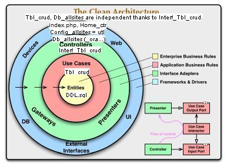

```php
<?php
interface IDBcls {
  // CRUD read any DB table rows class contains cc, rr, uu, dd methods
  public function cc(); // Create any DB table row method
  public function rr(); // Read any DB table row method
  ...uu, dd
}

class Mysqlcls implements IDBcls {
  public function rr() {
  ?>
    <br>rr method said : this txt we can load from some <b>Mysql DB table row</b>
  <?php
  }
}

class Oraclecls implements IDBcls {
  public function rr() {
  ?>
     <br>rr method said : this txt we can load from some <b>Oracle DB table row</b>.
  <?php
}
}

/* interface IRepcls { // also possible
public function usesrr(IDBcls $db);
} */

//class Repcls implements IRepcls {
class Repcls {
  public $db ;

  public function __construct(IDBcls $db) {
    $this->db = $db;
  }
  public function rr() {
    $this->db->rr();
  }
}

// Client
$mysql = new Mysqlcls();
$report_mysql = new Repcls($mysql);
$report_mysql->rr();

$ora = new Oraclecls();
$report_ora = new Repcls($ora);
$report_ora->rr();

//output :
//rr method said : this txt we can load from some Mysql DB table row
//
//rr method said : this txt we can load from some Oracle DB table row. 

```


<br><br>
<p> </p>
<h3>SOLID </h3>
<p>is group of 5 programming principles created by Robert C. Martin (uncle Bob) 
:<br></p>
<ol>
	<li>S ingle-responsibility. <span class="auto-style2"><strong>SRP 
	</strong></span>class should only have one reason to change, ee <strong>class should do only one 
thing </strong>- every class is owned exactly by one entity - <strong>person who 
	manipulates data has his class methods</strong>. It is people who request changes. And you don’t want to 
	confuse those people, or yourself, by mixing together the code that many 
	different people care about for different reasons. <br>     
	<a href="https://dev.to/tamerlang/understanding-solid-principles-single-responsibility-principle-523j">
	https://dev.to/tamerlang/understanding-solid-principles-single-responsibility-principle-523j</a>
	</li>
	<li>
	<span class="auto-style2"><strong>O pen-closed </strong></span>
	Software entities (classes, modules, functions, etc.) should be open for 
	extension, but closed for modification - 100% ready to be used by other 
	classes - its interface is clearly defined and won’t be changed in the 
	future  - keep the existing code from 
	breaking when you implement new features - <strong>do not modify code, but 
	extend it</strong>. Create a subclass and override parts of the original 
	class that you want to behave differently or you can extend the 
	functionality and add your own methods. You'll achieve your goal but also 
	won't break the existing functionality of the original class. If you see a 
	bug then go ahead and fix it; don't create a subclass for it. </li>
	<li><span class="auto-style2"><strong>L iskov</strong></span> substitution - 
	in object-oriented programming, subclasses should be able to substitute 
	their parent classes without breaking any client functionality. 
	
 <ol><li> <strong>Parameter types</strong> in a method of 
	a class should match or are more abstract than parameter types in the 
	superclass. Eg feed(Dog d) : we created a subclass that overrode feed(Dog d) 
	so that it can feed any animal (a superclass of dogs): feed(Animal d) - 
	method can feed all animals, so it can still feed any cat passed by the 
	client.  </li>
	 <li>Inverse to the requirements of the parameter type :  The <strong>
	 return type</strong> in a method of a subclass should match or be a subtype 
	 of the return type in the superclass.  </li>
	 <li>...
	 <a href="https://dev.to/tamerlang/understanding-solid-principles-liskov-substitution-principle-46an">
	 https://dev.to/tamerlang/understanding-solid-principles-liskov-substitution-principle-46an</a> </li>
	</ol>
	<li><strong><span class="auto-style2">I nterface segregation (separation) </span> 
	</strong>no 
	client should be forced to depend on methods it does not use. 
	Ee interface shouldn't force a class to implement methods that it won't be 
	using. Do I have a bunch of one method interfaces? No. SOLID principles 
	shouldn't be followed to the teeth, eg PizzaIface fn orderPizza($qty) class 
	PizzaOrder, DrinkIface...</li>
	<li><span class="auto-style2"><strong>D ependency inversion
	<a href="https://dev.to/tamerlang/understanding-solid-principles-dependency-inversion-1b0f">https://dev.to/tamerlang/understanding-solid-principles-dependency-inversion-1b0f</a></strong></span>
	
	High-level modules 
should not import anything from low-level modules; they should <strong>both 
depend on abstractions</strong>. Abstractions should not depend on details. 
Details should depend upon abstractions.
<p>Code that doesn't follow this principle can be <strong>too coupled</strong>, 
hard to manage the project. </p>
<p>Report class does not depend concretely on the database class (details) but 
on its abstraction DatabaseInterface. This approach also follows the <strong>
<span class="auto-style2">open-closed</span> 
principle</strong> because <strong>to use any new DB we don\'t have to change Report class</strong>. We just need to add a new database class that implements the 
DatabaseInterface.</p>
<p>For me, it doesn't matter whether <span class="auto-style2"><strong>car 
engine</strong></span> (details) has changed, I still should be able to drive my 
car the same way. <br>Details should depend upon abstractions, same as high-level 
modules (brakes , reports) - I would not want an <strong>engine that causes the 
brake to double the speed</strong>. </p>
	<br>
	</li>
</ol>
<p><br></p>
<h3>Clean Code Project - readable code</h3>
<p>"Any fool can write code that a computer can understand. Good programmers 
write code that humans can understand."             
- Martin Fowler           <a href="https://www.freecodecamp.org/news/clean-coding-for-beginners/">
https://www.freecodecamp.org/news/clean-coding-for-beginners/</a> </p>
<p><a href="https://github.com/abiodunjames/Awesome-Clean-Code-Resources">
https://github.com/abiodunjames/Awesome-Clean-Code-Resources</a> </p>
<ol>
	<li>Always think if your code is <strong>easy to understand<br></strong></li>
	<li>Write small functions and classes, respect <strong>KISS</strong> principle = Keep
	It Simple, Stupid, respect 
	<span class="auto-style2"><strong>SRP</strong></span> 
		= Single Responsibility Principle is same as Small functions concept. 
		Function and class should only do one thing (should have only one reason 
		to change).  <strong>DRY</strong> (Don't repeat
	yourself) principle is a more specific version of KISS - 
	functions in clean code should <strong>only do one thing
	within the overall system</strong>. 
	
	
	The opposite of DRY is <strong>WET</strong> (We enjoy typing). Code is WET 
when there are unnecessary repetitions in the code.<br><br>Small functions advantages (<strong>function 5-10 lines, class 10-50-100 
	lines</strong>):
	
	<ol>
	<li>Easy to understand, maintain, debug, reuse, test, keep bug free, beautify code.<li>Avoid code repetition (<strong>code redundance</strong>), but also use SRP to avoid	<strong>too coupled code</strong>, hard to manage the project 
		(complicated, nonunderstandable if-commands).<br>
	<li>Separate concepts into their <strong>levels of abstraction : Layers :
	    <br>
      <!--img alt="layers" longdesc="Clean_Architecture.jpg" src="not working on github https://www.base64-image.de/" 
      alt="Clean_Architecture_small.jpg" /-->
 


	
	
	<br>Clean_Architecture.jpg description</strong>: 
	(in <a href="https://github.com/nazonohito51/clean-architecture-sample">
	https://github.com/nazonohito51/clean-architecture-sample</a>)<br><br>
	<strong>Entitiess</strong>- 1st (inner) circle - YELLOW.
		Entities encapsulate <strong>enterprise wide business rules</strong> <br>
	It doesn't matter so long as the entities could be used by many different 
	applications in the enterprise. <br><br><strong>Use Casess</strong>- 2nd circle (1st 
		outer circle) - HIGHER LAYER - PINK. The software in this layer 
		contains <strong>application specific business rules</strong>.     <br>
	These use cases orchestrate the <strong>flow of data to and from the entitiess</strong>, and direct those 
		entities to use their enterprise wide business rules to achieve the 
		goals of the use case.. <br><br><strong>Interface Adapterss</strong>- 
	3rd - HIGHER LAYER - GREEN<br>The software in this layer is a set of adapters thatt
	<strong>convert data</strong> from the format most convenient for the use cases and 
		entities.. <br>That will wholly contain the MVC architecture of a GUI.
	<br>The models are likely just data structures that are passed from the 
		controllers to the use cases, and then back from the use cases to the 
		presenters and views.. <br><br><strong>Frameworks & Driverss</strong>- 
	4th - HIGHER LAYER - BLUE<br>The outermost layer is generally composed of frameworks 
		and tools such as the <strong>Database</strong>, the Web Framework, etc.. <br><br>
	<strong>Dependency Rule </strong>is overriding rule (Glavno pravilo) that makes 
	Clean Code rchitecture work :<br> <br>1. Source code dependencies can 
	only point inwards : <br>- Nothing in an inner circle can know anything at all 
		about something in an outer circle..<br>- The name of something declared 
		in an outer circle must not be mentioned by the code in an inner circle..<br>We usually resolve this apparent contradiction by using the 
	<strong>dependency 
		inversionn</strong> Principle ::<br><br>High-level modules should not import 
		anything from low-level modules; they shouldd <strong>both depend on 
		abstractionss</strong>. Abstractions should not depend on details.<br>
	<br>2. Typically the data that crosses the boundaries is simple data 
	structures.<br>- You can use basic structures or simple Data Transfer 
	objects if you like.<br>- Or the data can simply be <strong>arguments in 
		function calls</strong><br><br></li>
   </ol>

	<li> Don't cross different levels of abstraction</li>
	<li> Give <strong>
	proper names</strong> and use the scope rule - Stay away from comments and 
	express yourself in code<br>     Some comments are ok<br>     
	- When you can't express yourself with code:<br>         
	//Extract the text between the two title elements<br>         
	$pattern = "(?i)(<tit1e.*?>)(.+?)()";<br>    - When you want 
	to warn people</li>
	<li> Less than three parameters</li>
	<li><strong>Don't use 
	boolean or null arguments</strong></li>
	<li> Beautify predicates when appropriate</li>
	<li> Use <strong>only custom runtime exceptions<br></strong>     
	- Use exceptions instead of error codes<br>     - Use 
	your own exceptions</li>
	<li> Treat objects properly keeping in mind if they are
	<strong>OOP Objects or Data Structure objects</strong>.</li>
	<li> <strong>Use 
	Composition over Inheritance</strong><br>     Signs that 
	inheritance is plotting against you :<br>     - You want 
	to inherit more than one class (greed, pohlepa)<br>     
	- You feel like you inherit too much<br>     - The 
	abstract world shatters (Dog becomes FoodEeater, BallChaser, MansBestFriend)</li>
	<li> Be on the watch for symptoms of bad code :<br>    1. 
	Rigidity - Code is <strong>hard to change</strong>. Business is scared to 
	ask for things because everything takes so long.<br>    2. 
	Fragility - When you <strong>touch code in one place it breaks in another</strong>. 
	Business is afraid to ask for things<br>        
	because the    projects breaks everytime you change it.<br>    
	3. Immobility - You <strong>can't reuse your methods and classes</strong> - 
	changes take long time. <br>    4. Viscosity - It's hard to 
	do anything because of <strong>design / framework / development</strong> 
	environment<br>    5. tests <strong>run time / deploy time</strong> 
	- changes take long time.</li>
	<li> Treat <strong>state</strong> carefully. What is state in 
	programming and why is it important :<br>      - 
	State is prone (sklon) to bugs.<br>      - Keep 
	mutable objects small.</li>
	<li> Keep your <strong>coupling low and your cohesion 
	high</strong></li>
	<li> Try to use <strong>command and query separation</strong>,
	<strong>tell don't ask</strong> and even the <strong>law of Demeter</strong></li>
	<li> Don't use <strong>complex patterns and don't over-engineer</strong><br>
	<br></li>
</ol>
<p class="auto-style1">
<a href="https://en.wikipedia.org/wiki/James_Martin_(author">https://en.wikipedia.org/wiki/James_Martin_(author</a>) 
<br>From the 1990s 
	onwards, Martin (1933-2013) lived on his own private island, Agar's Island, 
	in Bermuda. In 2004 Martin donated £60m to help establish The Oxford Martin 
	School.<br>1976. Principles of Data-Base Management<br>1985. Diagramming 
	techniques for analysts and programmers. With Carma McClure.<br>1992. 
	Object-oriented analysis and design.</p>
<p> </p>
</body>
</html>