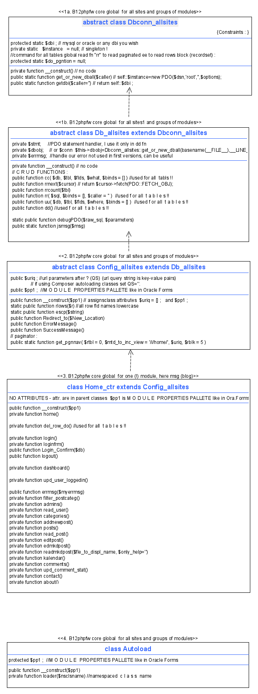

# 1. PHP menu & CRUD code skeleton (I named it B12phpfw)
## 1\.1 Demo site - free hosting with free Mysql
1. On Linux : http://phporacle.eu5.net/ (freehostingeu- fast, stable) 
2. or  http://phporacle.heliohost.org/ (heliohost - slow, stable)
3. My blog :  http://phporacle.altervista.org/13-php-7-4-2-bootstrap-4-3-1-laravel-6-12-crud-tutorial/  
    and  http://phporacle.altervista.org/fwphp/www/ - tech core of Mondadori digital magazine (leading publishing company in Italy) plans to offer free MySQL. 
     
## 1\.2 Download and install code from here
1. https://github.com/slavkoss/fwphp - PHP code here is good for (more) large sites
2. In webserver doc root - my is J:\xampp\htdocs  or virtual host  J:\awww\www
3. Unpack fwphp-master.zip (with many adds < 3 MB) : 3 subfolders : **fwphp,  vendor (from 00_vendor.zip file) and zinc**        


## 1\.3 B12phpfw directories (modules) structure compared to (all ?) other PHP fw-s

 ## (Apache) WEB SERVER DOCROOT-s
See **info code :**        
http://phporacle.eu5.net/fwphp/glomodul/z_examples/03_info_php_apache_config_scripts.php       
https://github.com/slavkoss/fwphp/blob/master/fwphp/glomodul/z_examples/03_info_php_apache_config_scripts.php        

  my **DEVELOPMENT DOCROOT** J:\\awww\\www ee http://dev1:8083/         
   **TEST DOCROOT** J:\\xampp\\htdocs ee   http://localhost:8083/fwphp/www/        
  **PRODUCTION (DEMO) DOCROOT** http://phporacle.eu5.net/       
```
|       
|-- **1. fwphp** (app)       # **or SITE1, or APLications1** = Main MVC site dirs structure,               
|   |                        # my J:\awww\www\fwphp\ = Apache_docroot\fwphp         
|   |                        # Contains **MODULE GROUPS** eg APLication1, 2.  eg  **www** (main menu), **glomodul**, **finance**, **material**          
|   |                                            #  fwphp is optional name. Namespace is only one: B12phpfw.            
|   |-- Controllers          # **NO M,V,C dirs (ee NO Controllers dir) but dirs are like Oracle FORMS form module .fmb  !**         
|   |   └── example.php      # Example Controller with basic functionality explanation. Start here learning !         
|   |                        #  My is https://github.com/slavkoss/fwphp/tree/master/fwphp/glomodul/z_examples/02_MVC/01vanilla       
|   |         
|   |-- Models               # **NO M,V,C dirs** ee NO Models directory       
|   |   └── example.php      # Example Model with functionality explanation       
|   |                        #  My is https://github.com/slavkoss/fwphp/tree/master/fwphp/glomodul/z_examples/02_MVC/01vanilla       
|   |         
|   |__ Views                # **NO M,V,C dirs** ee NO Views directory, no template engines, PHP is template language        
|        
|        
|-- **2. zinc** (core)       # Basically mvc engine directory. zinc is for search more selective than core  -:).                  
|   |                        # Here are **class Autoload and other all sites global classes** and some public resources                 
|   |                        # (some are in vendor dir).            
|   |-- app.php              # **NO** Main fw file. **$app = new App();  $app->autoload(); $app->config(); $app->start();**       
|   |                        # is nice abstraction but with questionable value in real life programming.                 
|   |                        # Where is UML diagram for this beauty ?        
|   |                        # I think much better is **new Home\_ctr($pp1) ** // Home\_ ctr "inherits" index.php ee "inherits" $pp1,      
|   |                        # (global & module prroperties palette array) but also inherits see B12phpfw core UML diagram below.      
|   |             
|   |-- classes              # **NO** classes directory for autoloading.         
|   |   |                    # B12phpfw global classes are in zinc dir, module clses are in module dir.       
|   |   |-- controller.php   # **NO** but **in module dir global abstract DISPATCHER (RESPONSE) class**             
|   |   |                    # **Home\_ctr  (<span style="color:blue;">level 4<span>)** extends Config\_allsites         
|   |   |__ model.php        # **NO, no model class for each table** but **in zinc dir global abstract CRUD class               
|   |                        # Db_allsites  (<span style="color:blue;">level 2<span>)** extends Dbconn_allsites             
|   |                        # In Db_allsites are **cc, rr, uu, dd methods** instead model class for each table !        
|   |                        # cc, rr, uu, dd methods are like Oracle Forms           
|   |                        # pre-insert, pre- and execute- query, pre-update instead model class for each table !         
|   |                        # To me seem model class for each table and ORM-s, active records not needed.         
|   |       
|   |-- config               # **NO** config dir but **in zinc dir global abstract CONFIG & ROUTING (REQUEST) class**            
|   |   |                    # **Config_allsites  (level 3)** extends Db_allsites (see core UML diagram). Here is property palette array.           
|   |   |-- database.php     # **NO** but in zinc dirabstract class **Dbconn_allsites  (<span style="color:blue;">level 1<span>)**        
|   |   |__ session.php            
|   |                     
|   |__ helpers              # **NO** helpers dir, but in zinc dir global abstract classes Db_allsites and Config_allsites.          
|       |__ examplhelper.php # **NO** but own debugging and Xdebug php extension.              
|      
|       
|-- **3. index.php**         # redirects to main menu url fwphp/www/index.php        
|      
|         
|-- **4. vendor** (public)   # dir for external code (vendor's plugins) & resources :  javascript files, stylesheets.            
|   |                        # B12phpfw has own (internal) resources in zinc dir, external in vendor dir.          
|   |-- javascripts          
|   |-- stylesheets          
|   |__ vendor           
|     
|         
|-- .htaccess                # **NO** .htaccess (Apache mod_rewrite) URL rewriting all requests to MVC endpoint index.php            
                             # (single module entry point). B12phpfw has **QS=?** constant instead.       

```


**Common fw dir structure are items in (...) and marked with NO - are not used in B12phpfw but basics are same**. B12phpfw is better for large sites.      
See Mini3 PHP framework [https://github.com/panique/mini3](https://github.com/panique/mini3) which is excellent rare not to simple MVC example (lot of good coding). My **routing using key-values** is different but dispatching using home class methods is based on Mini3. 
See to simple examples and have no namespaces  : very good coding : https://github.com/ngrt/MVC_todo or https://github.com/DawidYerginyan/simple-php-mvc/ or mani others.      

B12phpfw is very diferent than all other PHP frameworks because dirs are like Oracle FORMS form module .fmb and other mentioned above.      


## 1\.4 B12phpfw core UML diagram - classes structure

    
<br /><br />

Developed on home PC Windows 10 64 bit and Apache web server. Some details are to do in version 6.1 but all important is visible in current version 6.0. 

1. Menus (Mnu module) are not based - no need, but can be based on B12phpfw which is best for CRUD modules like Oracle Forms form. 
2. Most frequent (best ?) blog design today (I used it in Blog (Msg) module based on B12phpfw code skeleton)
3. WYSIWYG Markdown or HTML editing (Mkd module not based - no need, but can be based on B12phpfw is used for blog posts or any txt file). Blog posts may be :
    1. oper. system files - practicaly unlimited size
    2. or in MySQL/Oracle/or any DB : post (4000 characters I commented this in code), summary (4000 characters) and banner_img description (4000 characters) 


<br />        
Explanations below are far less important than demo site and code download mentioned above - open code and learn it, it is simple but needs      
> few hours (advanced user) - days (intermediate) - weeks/months (beginner) to understand it.           
**Understand code is must for any professional code skeleton !**       
<br />

         _.-'''''-._
       .'  _     _  '.
      /   (o)   (o)   \
     |                 |
     |  \           /  |
      \  '.       .'  /
       '.  ''---''  .'
         '-._____.-' 


# 2\. My developing environment (IDE)


## 2\.1 [Git SCM distributed version control system](https://git-scm.com/downloads)

see  https://git-scm.com/book/en/v2   or eg  https://git-scm.com/docs/git-checkout         

### In Windows Symenu Cmder as administrator (or CLI or Git Bash CLI)
J:\\aplp\\aplp\\0\_symenu\\ProgramFiles\\SPSSuite\\SyMenuSuite\\Cmder\_sps       

Go to your working directory or project folder (if not git status says: "fatal: not a git repository (or any of the parent directories): .git").      

git config --global user.name 'yourname'         
git config --global --replace-all user.email 'youremail'         
Install Git Credential Manager for Windows to avoid login on each push.      

### git status

### cd j:\\awww\\www

### j:\\awww\\www (master -> origin)

### git status

### git add .
or git add fwphp\\ (or whatever git asks)  or git add -A  or git add index.html

### git commit -am "ver 6.0 mnu, msg, mkd FUNCTIONAL namespaces, CRUD PDO, pretty URL-s"
We stored our project files within our system hard drive.      
If Cmder shows error  "fatal: unable to auto-detect email address" :      
git config --global user.email "you@example.com"      and         git config --global user.name "Your Name"       
to set your account's default identity.    Omit --global to set the identity only in this repository.       

### git push -u origin master
We stored our project files within our Github site.      

You want to restore an old revision of a file:
git checkout 8a7b201 index.html
If you specify "HEAD" as the revision, you will restore the last committed version of the file, effectively undoing any local changes that you current have in that file:       
git checkout HEAD index.html     

We can roll back our deleted files in working directory using command:      
**git checkout -- .**    
or git checkout -- <file>...         


Git is program and [Github](https://github.com/) is site - deploy ( [book](https://git-scm.com/book/en/v2/Git-Basics-Working-with-Remotes) ) [Tutorial](https://www.atlassian.com/git/tutorials/setting-up-a-repository)

Git we use eg to syncronize our scripts :     
1.  to your local repository (git commit to .git dir on local PC)     
2.  and from local repository to remote repository on Github site (git push)      

Track the history of the changes where, when, who and why made. git SW stores or host the versions of project within our hard drive. From where we can backup our project history.  GitHub  site is like hosting to store our versions of projects (case HD crash !).       
Staging is like a queue, add drops modified files here for push.      
Push (commit) is method to send the files from working directory to repository.         
Pull is method to fetch the record from repository to our working directory.   


## To purge remote repository

So only last commit remains and it is first commit :

Save your .git/config before, and restore it after. (I delete it in recycle bin).
1. delete .git/   (< 10 MB) - without this command : git remote add origin... issues error : fatal: remote origin already exists !!
2. git init   (< 20 kb)
3. git add .  (< 3 MB)
4. git commit -am "ver 6.0 mnu, msg, mkd FUNCTIONAL namespaces, CRUD PDO, pretty URL-s"
5. git remote add origin https://github.com/slavkoss/fwphp.git
6. git push --mirror --force

  
  
## 2\.2 Development environment & source code

My PHP IDE is **Symenu** as launcher for all SW (portable if possible) below :

1.  **EDITOR**: Notepad++ (6 MB), also good, all portable : Notepad2-mod (2 MB), Atom (524 MB), Visual Studio Code (247 MB), CudaText (28 MB), PSPad (23 MB), RJ TextEd (416 MB), I avoid Dreamveawer, Microsoft Expression web (abandoned but still good), Komposer (abandoned, too old)  
    GT Text OCR IMG->TXT
2.  **COMMANDER**: **Locate** is old but best (Janne Huttunen) or simmilar see Symenu.     
    Freecommander       
    Q-dir          
3.  **BROWSER**: Firefox, Google Chrome, Cyberfox, Pale Moon
4.  **DEPLOY (INSTALL)**: Composer  
    Git and Github      

##  2\.3 [Composer](https://getcomposer.org/download/)

I use newest XAMPP 64 bit xampp-portable-windows-x64-7.3.7-1-VC15.7z on newest Windows 10, 64 bit. WAMP not any more because is not fully portable and Composer needs coding displayed below and it is only for Windows. It seems WAMP is not giving newest/simplest solutions as XAMPP does.

        WAMP does not like PHP in Windows PATH variable, so :
        1. I installed Composer-Setup.exe and removed PHP from PATH. 
        2. **C:\composer\composer7.bat** :
        ```
        @echo OFF  
        :: in case DelayedExpansion is on and a path contains ! 
        setlocal DISABLEDELAYEDEXPANSION
        J:\wamp64\bin\php\php7.2.9\php.exe "%~dp0composer.phar" %*
        ```
        Save file along with the originally installed composer.bat file.
    
        3. Now call the php7 composer with the new command:
        ```
        In Windows CLI, cd J:\awww\www and as admin : 
           composer7 selfupdate   (1.8.4, 2019-02-25, Use composer self-update --rollback to return to version 1.7.3)
           composer7 update
        ```


## 2\.4 Free hosting with free MySql (or Mariadb) DB
**Demo site** free hosting where blog (msg) module is installed **http://phporacle.eu5.net/ (freehostingeu) or  http://phporacle.heliohost.org/ (heliohost) **. Some details are to do in version 6.1 but all important is visible in version 6.0.      
I do not like heliohost activity requirement: "you must visit your site each month" or will be suspended for inactivity after 30 days. They should allow for ever free sites useful for sharing knowledge. I like heliohost simple, clever, very useful pages. I do not like freehostingeu feature "upload zip files not allowed".   

|       Web hosts PHP,  MySQL DB                             |                           Features                                |Other Features |
| ----------------------------------------------------------------- | ------------------------------------------------------- | ------------------------------------------ |
|  **http://phporacle.eu5.net/ (freehostingeu)**        | stable, fast FTP (6x faster than heliohost) |  upload zip files not allowed, but possible  |
|  **http://phporacle.heliohost.org/ (heliohost) **     |  stable FTP, Web Disk  | ~~not fast (I am in Europe, Zagreb), activity requirement~~ |
| Heroku                                                               |  ~~only Postgres DB~~  |  ~~seems complicated to me~~  |
| https://www.gigarocket.net/free-hosting.php    |  ~~does not send confirmation email~~  |  |
| https://infinityfree.net/                                       |   ~~does not send confirmation email~~  |  |
| https://www.ilbello.com/en/                              |   ~~does not send confirmation email~~  |  |
| https://www.000webhost.com/                          |  ~~**unstable FTP**~~  |  |
Some ask 3, 5 or 15 $ (per year ?) for domain (eg https://client.googiehost.com/ , https://www.freehosting.com/free-hosting.html , https://cp1.awardspace.net/beta/login/).      


  
# 3\. PHP 7, Bootstrap 4 : DB tables rows PDO CRUD
May be jQuery, PHP, Bootstrap AJAX DB table rows CRUD is simplest, fastest best CRUD but I prefer no jQuery AJAX . Only Javascript I need is dialog yes or no.

## B12phpfw code snippets
### B12phpfw core UML diagram - classes attributes & methods (made with Symenu yEd)
CRUD db tables rows modules like my msg (blog) should be based on code skeleton shown in  UML diagram. Non CRUD modules like my mnu and mkd : without such code skeleton **may be code is simpler ?** If mnu module (which is links to pages / modules) needs CRUD functionality (I think never needs), we should base it on code skeleton shown in  UML diagram. Both global db classes are ~400 lines, global config class is ~400 lines - they are so small that may be included in any module. Interesting detail: Msg (blog) module has no problem, but in Mnu module global ftr.php displays: Fatal error: Uncaught Error: Using $this when not in object context in J:\awww\www\zinc\ftr.php       


<br /><br />
$do\_pgntion attribute in class Dbconn\_allsites is used in **module msg ee blog**  fwphp\glomodul\blog, in home.php, home_side_area.php and dashboard.php eg so :     
```
self::$do_pgntion = '1'; //command for all tables global read fn "rr" to read paginated ee to read rows block (recordset)
$c_posts = $this->rr( "SELECT * FROM posts WHERE $qrywhere", $binds
   , __FILE__ .' '.', ln '. __LINE__ ) ;
```

There are not many important PHP statements in classes above, but we must understand them !!       
Understand means learn all **conventions** (which are more important then **configurations**). Eg :       

**../../../** is path to www dir ee to web server or to ISP (inet hosting) folder.       

**$pp1** is properties global container array like Oracle forms property palette.     

In msg (blog) module are two masters (usr, category) 1:M posts rows, and two level of details posts 1:M comments.     

R O U T I N G  T A B L E  is in array $this->pp1 assigned in class Home_ctr which extends Config_allsites     
After **i/** is method in this->Home_ctr which **includes/calls** same named (or not) script/method or calls some (global method) or...     
**QS=?**=url adress Query separator (url query is key-value pairs). Without QS we must use Apache mod-rewrite and Composer auto loading classes instead own simple-fast auto loading.        

DISPATCHER  includes, calls and **http jumps only to other module**. So **we may not use constants but module property palette $pp1 which contains globals !**

**cc, rr, uu, dd** rows CRUD methods are used for all tables !!

# 3\. 1 B12phpfw module code snippets - module bootstrap, configuration, router, dispatcher
Two module scripts and four scripts global for all sites are  B12phpfw (programming **skeleton** for links =menus and CRUD). Like any good programing **templates** (**framework**) it is not easy to understand them but is very useful !!

### BLOG (MSG) MODULE SCRIPT 1:   index.php
```php
<?php
//J:\awww\www\fwphp\glomodul\blog\index.php, J:\awww\www=WEBSERVER_DOC_ROOT_DIR=../../../
// ?=QS, p=page=1, i=call Home_ctr method 'home()' to include (or call, or jump to) :
//http://dev1:8083/fwphp/glomodul/blog/?p/1/i/home/ 
namespace B12phpfw ; //FUNCTIONAL, NOT POSITIONAL eg : B12phpfw\zinc\ver5
//1.
$dirup_tmp = str_replace('\\','/', dirname(__DIR__) ) ; 
$pp1 = (object) //=properties global array (like Oracle Forms property palette)
[   'dbg'=>'1', 'caller'=>[[str_replace('\\','/', __FILE__ ).', lin='.__LINE__]]
  //1.1
  , 'module_towsroot'=>'../../../' //to web server doc root or our doc root by ISP
  //1.2
  , 'module_version'=>'6.0.4.0 Msg', 'vendor_namesp_prefix'=>'B12phpfw'
  //1.3
  , 'module_path_arr'=>[ //MUST BE NUM INDEXED for auto loader loop (not 'string'=>...)
        str_replace('\\','/', __DIR__ ).'/' //=thismodule_cls_script_path (CONVENTION!!)
      , $dirup_tmp.'/user/', $dirup_tmp.'/post_category/', $dirup_tmp.'/post/'
      , $dirup_tmp.'/post_comment/'
  ]
] ;

//2.
require($pp1->module_towsroot.'zinc/Autoload.php'); //or Composer's autoload cls-es
$autoloader = new Autoload($pp1); 
                if ('') {Db_allsites::jsmsg( [ basename(__FILE__) //. __METHOD__ 
                   .', line '. __LINE__ .' SAYS'=>' '
                   ,'where am I'=>'AFTER  A u t o l o a d'
                ] ) ; }
//3.
$db = new Home_ctr($pp1) ; // "inherits" index.php ee inherits $pp1

exit(0);

//1. C O N F I G  coding step cs01.
//1.1 MODULE_LEVEL Yii style (see other style : ...z_examples\tasks\www\index.php)
//1.2 version: '1site_ or_ allsites_ver.2ddlver.3dml_ or_ scripts_ver.4errcorrection'
//1.3 Module dirs: this mdle and other mdle`s = array to autoload module clsscripts
//    like properties group "autoload" in J:\awww\www\composer.json :
//2. C O N F I G  coding step cs02. eliminates need to manually include class scripts
//TODO: (For now) J:\awww\www\zinc\Dbconn_allsites_mysql.php
//                copy to ...\Dbconn_allsites.php
//3. C O N F I G  - C R U D  C L A S S E S,  R O U T I N G,  coding step cs03.


//        MODULES ARE IN 4 LEVELS (module is like Oracle Forms .fmb)
//J:\awww\www=WEBSERVER_DOC_ROOT_DIR.    '../../../' means 4 LEVELS OF MODULES DIRS:
//1.module (dir blog) 2.mdlegroup (glomodul), 3.site (fwphp), doc_root (www)
//      MODULE CODE in execution order, eg Blog IS IN 5 OR 6 CODE LEVELS :
// 1.LEVEL5 index.php 2.L3 new Home_ctr($pp1) (3.L4 Home_mdl if needed) extends 4.
// 4.L2 Config_allsites extends 5.L1 Db_allsites, 6.L6: home.php, zinc/hdr.php and ftr
//see http://localhost:8083/pdogridbig_original/demo/pages/
//    http://dev1:8083/fwphp/glomodul/z_examples/05_flex01_2col.php

/* (***1)
unset($array[$i]); then Re-index: $array = array_values($array);
$idxtmp = array_search ('p', $module_ arr['ctr akc par_ arr']);

works $$obj->{$akc}($$params_arr_adress) ; // eg f unction upd_ comments_ stat($db)
works $$obj->{$akc}($db) ; or $this->{$akc}($db) ;

count (sizeof) works on arr & custom object that implements the Countable interface
casting obj as arr is ok for simple stdClass object (won`t always work)
if (count((array)$this->uriq)) {...
foreach($module_ arr['ctr akc par_ arr'] as $k=>$v) { 
   if ($v=='p') { $page_ from_url = $module_ arr['ctr akc par_ arr'][$k+1]; } ...
*/
```

### BLOG (MSG) MODULE SCRIPT 2:   Home_ctr.php
20 kB controller code, lot of code, but code is very simple, **few important code lines** are :
```php
//J:\awww\www\fwphp\glomodul\blog\Home_ctr.php
// May be named App, Router_dispatcher... :
class Home_ctr extends Config_allsites {
...
    parent::__construct($pp1); //ROUTING ee $this->uriq object and adds elements to $pp1
      //extends Db_allsites ee cc,rr,uu,dd methods = DBI abstr.layer for PDO DBI abs.l.
      //extends Dbconn_allsites singleton DB obj
...
// R O U T I N G  T A B L E  (IS OK FOR MODULES IN OWN DIR) 
// We have two masters (usr, category) and two level of details (posts, comments).
// After i/ is method in this Home_ctr which includes/calls samenamed (or not) script/method or calls some (global method) or...
// QS=?=url adress Query Separator. Without QS we must use Apache mod-rewrite and Composer auto loading classes instead own simple-fast auto loading.   

... all module links (menu items) should be here      
$this->pp1->loginfrm        = QS.'i/loginfrm/' ;       
$this->pp1->del_row         = QS.'i/del_row_do/' ; //used for all tables !!      

// DISPATCHER:  includes or calls or http jumps (only to other module)
// i = ctrakcmethod of this cls  (H o m e) which includes view script or calls method (does tblrowCRUD...)
$akc = $this->uriq->i ; //uriq = url query string, default = home         
$this->$akc() ;       
...       
  private function home()        
  {
      $title = 'MSG HOME';
      require $this->pp1->wsroot_path . 'zinc/hdr.php';
      require_once("navbar.php");
      require $this->pp1->module_path . 'home.php';
      require $this->pp1->wsroot_path . 'zinc/ftr.php';
  }
...

private function del_row_do() //used for all  t a b l e s !!
{
                              if ('') { echo __METHOD__ .', line '. __LINE__ .' SAYS: '
                              .'<br />U R L  query array ='.'$this->uriq=' ;
                              if (isset($this->uriq))
                                { echo '<pre>'; print_r($this->uriq) ; echo '</pre>'; }
                              else { echo ' not set' ; } }
      $this->dd() ;
      // R e d i r e c t = r e f r e s h  t b l  v i e w :
      switch ($this->uriq->t)
      {
        case 'admins' : $this->Redirect_to($this->pp1->admins) ; break;
        case 'category' : $this->Redirect_to($this->pp1->categories) ; break;
        case 'posts' : $this->Redirect_to($this->pp1->posts) ; break;
        case 'comments' : $this->Redirect_to($this->pp1->comments) ; break;
        default: echo '<h2>'.$this->uriq->t .' does not exist' . '</h2>'; break;
        //default: $this->Redirect_to($this->pp1->filter_page) ; break;
      }

}
...
```

# 3\.2 B12phpfw core code snippets


### GLOBAL FOR ALL SITES SCRIPT 1: Config_allsites.php
17 kB contains global configs class which we change only for new functionality and testing
```php
// J:\awww\www\zinc\Config_allsites.php
...
class Config_allsites extends Db_allsites
{
...
// R O U T I N G
$uriq = [] ; //url parameters after QS=? (url query string is key-value pairs)
for ( $ii = 0 ; //expr1 executed once unconditionally at loop begin. Or: ,$x=1,...
            $ii < count($uri_qrystring_arr) ; //expr2 is evaluated at iteration begin
            $ii++ ) :              //expr3 is evaluated at iteration end
{
        if (isset($uri_qrystring_arr[$ii + 1])) {
          $uriq[$uri_qrystring_arr[$ii]] = $uri_qrystring_arr[++$ii] ;
        } else {
          if (!isset($uri_qrystring_arr[0]) or !$uri_qrystring_arr[0] ) 
             {$uriq = ['i' => 'home'] ; } //means url is module utl
        }
} endfor;
$this->uriq = (object)$uriq ;
...
$this->pp1 = (object)$pp1 ;
...
// also some helper methods :
static public function escp($string)
public function Redirect_to($New_Location){
public function ErrorMessage(){
public function SuccessMessage(){
public static function get_pgnnav( // P A G I N A T O R
```

### GLOBAL FOR ALL SITES SCRIPT 2: Db_allsites.php
17 kB contains global PDO CRUD class.
Contains 4 CRUD methods for any table : cc, rr, uu, dd. Outside code which calls cc, rr, uu, dd does know what they do (CRUD) but **does not know how (does not know PDO DBI exsistance).**      
```php
// J:\awww\www\zinc\Db_allsites.php
...
class Db_allsites extends Dbconn_allsites {
...
```


### GLOBAL FOR ALL SITES SCRIPT 3. :   Dbconn_allsites.php
**We other connection(s) on any lower level (site, group of modules, module)**      

### Copy one of next two to J:\awww\www\zinc\Dbconn_allsites.php !!  
Singleton dbconnect to Oracle or MySQL or... Singleton means that method "get\_or\_new" called many times instatiates class Db\_allsites only once (for each start of index.php).     
TODO: if possible do this code better. 

```php
<?php
// J:\awww\www\zinc\Dbconn_allsites_mysql.php
// single access point to our database (singleton class).
namespace B12phpfw ;
use PDO;
class Dbconn_allsites
{
    protected static $dbi    = null;
    private static $instance = null;

    private function __construct() {
    }

    public static function get_or_new_dball($caller)
    {
      self::$dbi = 'mysql' ;
      if(is_null(self::$instance)) {
        $dsn = "mysql:host=localhost;dbname=cmsakram" ;
        $options = [
           PDO::ATTR_PERSISTENT   => true
          ,PDO::ATTR_ERRMODE      => PDO::ERRMODE_EXCEPTION
          ,PDO::ATTR_ORACLE_NULLS => PDO::NULL_TO_STRING
        ];
        self::$instance=new PDO($dsn,'root','',$options);
        //self::$instance=new PDO("mysql:host=localhost;dbname=cmsakram",'root','',$options);
      }
      return self::$instance;
    }
}
```

```php
<?php
// J:\awww\www\zinc\Dbconn_allsites_oracle.php
// single access point to our database (singleton class).
namespace B12phpfw ;
use PDO;
class Dbconn_allsites
{
    protected static $dbi    = null;
    private static $instance = null;

    private function __construct() {
    }

     public static function get_or_new_dball($caller)
    {
      self::$dbi = 'oracle' ;
      if(is_null(self::$instance)) {
        $options = [
           PDO::ATTR_PERSISTENT   => true
          ,PDO::ATTR_ERRMODE      => PDO::ERRMODE_EXCEPTION
          ,PDO::ATTR_ORACLE_NULLS => PDO::NULL_TO_STRING
        ];

        $host = // USERDOMAIN = pcname eg sspc2 is ok for oracle not for mysql
          getenv('USERDOMAIN',true)?:getenv('USERDOMAIN').'/XE:pooled;charset=UTF8' ;
        $dsn  ='oci:dbname='.$host ;
        self::$instance = new PDO($dsn, 'hr', 'hr', $options); 
        //$dsn = "mysql:host=localhost;dbname=cmsakram" ;
        //self::$instance=new PDO($dsn,'root','',$options);
      }
      return self::$instance;
    }
}
      //WORK ALL THREE : (etenv('USERDOMAIN') does not work for MySql !!)
      //,'host'=>getenv('USERDOMAIN',true)?:getenv('USERDOMAIN').'/XE:pooled;charset=UTF8'
      //,'host'=>'sspc2/XE:pooled;charset=UTF8'
      //,'host'=>'localhost/XE:pooled;charset=UTF8'
      //
      // Safely get the value of an environment variable, ignoring whether 
      // or not it was set by a SAPI or has been changed with putenv
      //$ip = getenv('REMOTE_ADDR', true) ?: getenv('REMOTE_ADDR')
      // define  h o s t :
      //, 'host'=>'define  h o s t  in Config_ allsites.php'
```


### GLOBAL FOR ALL SITES SCRIPT 4: Autoload.php
6 kB contains autoload class which includes namespaced classes global for all sites, different modules classes or external classes
```php
// J:\awww\www\zinc\Autoload.php
...
```
  
  
  
  
  
# Code flow
Model code is most complicated. C and V code can be standardized, M only partially : cc, rr, uu, dd methods for all tables but bussines logic in M code can not be standardized.Config_allsites

User`s events are handled in Controller class.
- C assigns user's orders in URL to variables telling V what user wants and includes V (not showed in picture).
- V pulls data from M according C variables (user's orders in URL ).
- V also may call C method for some state changes ordered by user in URL, eg table row updates like approve user comment.
- V script may contain class but I do not see need for view classes because view script is included in Home_ctr class and can use $this to access methods and attributes in whole class hierarchy : Home_ctr, Config_allsites, Db_allsites. If we do not need CRUD than we do not need class hierarchy : Home_ctr, Config_allsites, Db_allsites meaning that simple structured (not oop) coding like in mnu and mkd modules is enough.

M-C-V data flow - controller instantiates M and pushes M data to V.
I do not see advantages compared to M-V data flow. Disadvantage are : for pagination M-V data flow is only possible solution, M-C-V data flow makes C fat in large modules (lot of code). C in my msg (blog) module has lot of code, but code is very simple.

So view instantiates model and pulls data from M or C instantiates model and pulls data from M. Difference is important only for us - for clearer code, both styles work ok.

If we have user`s interactions (events) eg filter displayed rows (pagination is also filtering), than M-V data flow is only possible solution. 


  
  
  
  
  
  

**WHY**  
Nobody made OOP MVC menu and CRUD PHP code skeleton (especially for each module in own folder) **clear and readable, instantly visible that it is best way** of coding - hence so much blah-blah. Modules for master-detail and link tables are even more rare. Strong-talk-weak-work people pollute info space wit hypes, vapor wares... because of ignorance or to promote himself, to earn money.
### To simple examples plague (in 99% learning materials)
Other reason : I tested ideas which seemed good, but after I added functionality (huge work !!), code was to complicated. This is why **to simple examples (in 99% learning materials) are bad idea !!**. We see if code (skeleton) is ok ONLY on **not to simple code examples (and on more of them)**. Code elements (snippets, mosaic pieces) must be as simple as possible but referencing - looking at not to simple example ! 

I think main reason for pretty URL-s is much simpler routing. Using $\_GET variables for routing is in my experience. ok only for simple modules like my mnu, mkd, lsweb, but not for msg or oraedoop modules.

> **Routing** - finding in URL what code call or include (calls/links constructing)  
> and **dispatching** - call or include code  
> was **nightmare** in all B12phpfw versions before 6.0 !! - **main reason for so many versions**.

My pretty URL-s are key-value pairs, so no need for "controller/action/param1/param2..." url style ee order of url pairs is as we wish. Next Notepad++ display shows how routing is **in 3 simple steps, all routings are so simple**. I do not like routing-dispatching I found during learning, next is what I think best dispatching.

**DISPATCHING HTML DISPLAY OF MARKDOWN FILE IN MSG (BLOG) MODULE ( Routing is in Config\_allsites.php ~30 lines code)** :

    Search "readmkdpost" (4 hits in 2 files)
      J:\awww\www\fwphp\glomodul\blog\Home_ctr.php (3 hits)
        Line 41:        $this->pp1->readmkdpost = QS.'i/readmkdpost/' ;
        Line 277:   private function readmkdpost($fle_to_displ_path)
      J:\awww\www\fwphp\glomodul\post\read_post.php (1 hit)
        Line 123:                   $this->readmkdpost($mkdflename);
    Search "readmkdpost" (5 hits in 2 files)

Explanation of code above :

1.  Routing table in Home\_ctr.php assigns  
    $this->pp1->readmkdpost = QS.'i/readmkdpost/' ; // key-value pair is i, readmkdpost , QS='?', $pp1=property palette = global parameters array.  
    Without QS (url adress Query Separator) we must use Apache mod-rewrite and Composer auto loading classes instead own simple-fast auto loading.  
    I tested Apache mod-rewrite and Composer auto loading classes in previous versions - worked, but we really do not need this complication.
2.  read\_post.php calls private function readmkdpost($fle\_to\_displ\_path) in Home\_ctr.php (uppercse script name means class script)
3.  readmkdpost method in Home\_ctr.php calss Parsedown text method to echo HTML of mkd txt (eg of J:/awww/www/fwphp/glomodul/blog/msgmkd/001. Menu\_CRUD.txt) :  
    echo $pdown->text(file\_get\_contents($fle\_to\_displ\_path)) ;


**WHAT**

1.  FW core code - **globals for all sites** in zinc directory is less than 50 kB. Site fwphp (wit many learning examples) is 4 MB like Bludit flat files CMS. OctoberCMS site (not better, less pages) based on Laravel framework is ~20 times bigger, has complicated settings (Dashboard, control panel like Yoomla).
    
    1.  **Config\_allsites.php** 17 kB contains global configs class which we change only for new functionality and testing
    2.  **Autoload.php** 6 kB contains autoload class which includes namespaced classes global for all sites, different modules classes or external classes
    3.  **Db\_allsites.php** 17 kB contains global PDO CRUD class CRUD methods cc, rr, uu, dd 
    4. ** Dbconn_allsites.php** class = singleton dbconnect to Oracle or MySQL or...  
        Contains 4 CRUD methods for any table : cc, rr, uu, dd.  
        
    4.  hdr, ftr
    
Do not fear of lot of global and module variables. Module and global config classes Home\_ctr.php and Config\_allsites.php are like Oracle Forms Property palette, but better.
    
Most important modules are :      
    
2.  **mnu module** [https://github.com/slavkoss/fwphp/tree/master/fwphp/www](https://github.com/slavkoss/fwphp/tree/master/fwphp/www) = main menu for groups of modules (home of site "fwphp" ). Like mkd module it is not B12phpfw CODE CONFIGURATION - not needed for simple modules.     

3.  **blog = msg module** See readme.md in  [https://github.com/slavkoss/fwphp/tree/master/fwphp/glomodul/blog](https://github.com/slavkoss/fwphp/tree/master/fwphp/glomodul/blog) 
See first easier to understand:
 **adrs module based on Mini3** PHP framework [https://github.com/panique/mini3](https://github.com/panique/mini3) which is excellent rare not to simple MVC example (lot of good work). My **routing using key-values** is different but **dispatching using home class methods** is based on mini3. This is CRUD of one table songs - ee of URL-s (adresses) of youtube songs. Songs can be played clicking on link. [https://github.com/slavkoss/fwphp/tree/master/fwphp/glomodul/adrs](https://github.com/slavkoss/fwphp/tree/master/fwphp/glomodul/adrs)               

4.  **mkd module** is used in msg (blog) module to dispatch (include) html display of post in markdown file. [https://github.com/slavkoss/fwphp/tree/master/fwphp/glomodul/mkd](https://github.com/slavkoss/fwphp/tree/master/fwphp/glomodul/mkd) = markdown WYSIWYG editor (SimpleMDE & Parsedown) Parsedown sintax highlighting [https://highlightjs.org/download/](https://highlightjs.org/download/) : \`\`\`css hljs.initHighlightingOnLoad(); \`\`\` mkd module is good to learn OOP programming (commented in index.php because for simple view scripts we do not need OOP). Simmilar small code is for Summernote HTML text WYSIWYG editor as for Markdown WYSIWYG markdown text editor which I use .         

5.  **lsweb module** is utility to all sites navigation and run php scripts, good for z\_examples dir (group of modules) which are not in mnu module links [https://github.com/slavkoss/fwphp/tree/master/fwphp/glomodul/lsweb](https://github.com/slavkoss/fwphp/tree/master/fwphp/glomodul/lsweb)          

6.  **oraedoop** is utility to all tables edit and export. Lot of session variables.          

8.  Many learning examples are in **modules in learn directory z\_examples** [https://github.com/slavkoss/fwphp/tree/master/fwphp/glomodul/z\\\_examples](https://github.com/slavkoss/fwphp/tree/master/fwphp/glomodul/z\_examples)

  
  
  

**HOW**  
Important is to learn :

1.  code skeleton,
2.  globals,
3.  how to include class script and instantiate contained class ("new" command) - namespaces, PSR-4 autoloading, class methods parameters in global parameters array $pp1
4.  how to include script (http jumps only to other modules), if you (as I) choose that not all included scripts are classes.

Home controller's methods include scripts or call methods according URL query parameters (uriq object). Important is that home controller's methods enable us to put some parameters in home controller's methods instead in URL - simple and clear coding.  
Routing table contains almost all module-in-own-folder\`s links. It is some more coding but code is very simple and clear.

**WHERE**  
Directories :

1.  **zinc** = includes, assets, framework core
2.  **fwphp** better named modules (we may use any name) = **site** = modules groups (unlimited levels) and modules :
    1.  modules groups are dirs eg glomodul, z\_examples...
    2.  modules like Oracle Forms are subdirs of modules groups dirs, eg www, adrs, blog, lsweb, mkd, post, user... There are no 3 dirs M, V, C for all modules ! Web server doc root (our hosting provider dir) eg J:\\awww\\www is all sites root (I have only fwphp site).

**WHO, WHEN**  
I tested more than 6 versions of mnu, mkd and msg modules based on other people work mentioned below. Lot, lot of work wasted during dozen years (thanks parasits) because of strong-talk-weak-work people. There is lot of details to do for which I had no time but can be easily built on grounds given here.

  
  
  


Explanations below are far less important than code mentioned above - open code and learn it, it is simple but needs few hours (advanced user) - days - weeks/months (beginner) to understand it.
  
  
PHP WEB modules like Oracle forms, ee each module in own dir (not three dirs M, V, C for all modules) - it is not easy to see need to eg for user module convert code from procedural MVC to OOP MVC with namespaces and autoloading like my fwphp modules : main mnu fwphp\\www5 and op.system files cRUd fwphp\\glomodul4\\mkd (c and d we do in op.system, not in mkd !). To me seems that my fwphp modules www5 and mkd could be best standard for large sites but I am not shure. For navigation (url-s, links) code is same - OOP does not help. Procedural MVC user module code is more clear and readable. So why is OOP better ?

Some say: "is OOP mistake ?" - eg lack of reusability in OOP - to get banana (some method or attribute) you get also gorilla holding banana and whole gorilla\`s jungle (all higher classes with complicated dependencies). Eg Interfaces help to get ONLY banana, but coding is complicated - I could find only strong-talk-weak-work code examples about this subject.

*   see [https://phpthewrongway.com/](https://phpthewrongway.com/), or Joe Armstrong why OOP sucks [http://harmful.cat-v.org/software/OO\_programming/why\_oo\_sucks](http://harmful.cat-v.org/software/OO_programming/why_oo_sucks).

  
  
  
  

B12phpfw is based on ideas in many tutorials eg next few are among best (but also on some ideas in best PHP frameworks Laravel, Simfony, Yii, Phalcon...) .         
I did much simpler B12phpfw code based on ideas in CMS blog, Mini3, Todo  example and others listed below. Books about PHP are not so good.

1.  CMS blog Video (7.7 GB) Jazeb Akram : Udemy - The Complete PHP MYSQL Professional Course with 5 Projects - **rare not to simple tutorial**. Similar is video (12.3 GB) Edwin_Diaz_PHP for Beginners - Become a PHP Master - CMS Project. Also some other videos - so seems they are best/simplest code skeletons for CMS blog  ee posts, messages. Videos are huge for commercial reasons to reach higher num_of_GB * $/GB but there is only minimal amount of code.
2.  [**Mini3**](https://github.com/slavkoss/fwphp/tree/master/fwphp/glomodul/adrs) (Mini3 PHP fw [https://github.com/panique/mini3](https://github.com/panique/mini3) - rare not to simple module but could have more functionality.
3.  https://github.com/ngrt/MVC_todo Code is explained in this article blog 2017.12.17: https://medium.com/@noufel.gouirhate/create-your-own-mvc-framework-in-php-af7bd1f0ca19
4. Other :
    1. video 8/2016 Paul Amissah [https://freecourseweb.com/building-database-web-app-php-oop-pdo-ajax-mysql/](https://freecourseweb.com/building-database-web-app-php-oop-pdo-ajax-mysql/) :  PHP, procedural MVC PDO MySQL, Bootstrap, AJAX jQuery - good basic code. **Not good are (as in almost all tutorials)** : names, globals,  code snippets composing - no single entry point ee including scripts instead http jumping in scripts
    3.  video Shan Shah 2019 [https://desirecourse.com/login-registration-and-profile-management-in-php-mysql-2018/](https://desirecourse.com/login-registration-and-profile-management-in-php-mysql-2018/),
    4.  video Learn\_OOP\_PHP\_By\_Building\_Complete\_Website\_by\_Traversy\_2018 [bad example](https://github.com/slavkoss/fwphp/tree/master/fwphp/glomodul/z_examples/02_MVC/traversymvc) to complisated, despite some good code snippets.
    5.  Inanz, Hopkins, Xuding... to simple examples good only for total beginers (dummies).

I made many changes (I hope improvements) which I did because I do not like proposed solutions in best php frameworks and in learning sources mentioned above  (especcialy coding eg Traversy tutorial). Globals are not well coded there. I think that eg invoice php code should be in **own folder - module - like Oracle forms invoice.fmb** (not all forms/reports in 3 folders: M, V, C). **Application** glomodul consists of group of modules subgroups - unlimited levels  eg subgroup [https://github.com/slavkoss/fwphp/tree/master/fwphp/glomodul/z\_examples](https://github.com/slavkoss/fwphp/tree/master/fwphp/glomodul/z_examples)

**Modules subgroups - unlimited levels**. This is important difference ! Can Laravel, Yii, Phalcon work this way (important for large applications) ?

I think that should be simple/fast/professional : **globals**, routing, dispaching, functional namespaces & classes loading , web rich text editing...  
It is why I spended so many hours on this (huge time wasting which should do tools-software authors, not tools-software users like me).


  
    
  

## Code with functional namespaces & class to autoload : global, module-local and external classes

This code skeleton seems complicated compared with [https://github.com/panique/\*\*mini3](https://github.com/panique/**mini3)\*\* which is may be best fw code template for smaller projects (and learning PHP).

For large projects **GLOBALS** which I use here are very important, same as **modules in own folders (not all in 3 dirs M, V, C)**.

About globals see discussion :  
[https://medium.com/@sameernyaupane/php-software-architecture-part-1-mvc-1c7bf042a695](https://medium.com/@sameernyaupane/php-software-architecture-part-1-mvc-1c7bf042a695)  
[https://medium.com/@sameernyaupane/php-software-architecture-part-2-the-alternatives-1bd54e7f7b6d](https://medium.com/@sameernyaupane/php-software-architecture-part-2-the-alternatives-1bd54e7f7b6d)  
[https://blog.ircmaxell.com/2014/11/alternatives-to-mvc.html](https://blog.ircmaxell.com/2014/11/alternatives-to-mvc.html)       


<br /><br /><br />
During winter 2019/2020 year (much to late because I tested lot what others did) I made Version 6. of **menu and CRUD PHP code skeleton (own framework named "B12phpfw")** - core code is less than 50 kB.     
I also made Blog (posts, messages) module **"Msg"** with posts edited with Mkd module's WYSIWYG Markdown SimpleMDE editor (or HTML WYSIWYG Sumernote editor or ... any editor you wish). Msg module is based on B12phpfw, also very small code.     
<br />
B12phpfw code skeleton and Msg application based on B12phpfw  are minimal PHP code to learn (medium knowlege) PHP !
<br />
Why ?  I do not like proposed solutions in  in best php frameworks (Laravel, Simfony, Yii...) and learning sources (internet, books). I think that eg module invoice php code should be in own folder like Oracle Forms form invoice.fmb (not all forms/reports in 3 folders: M, V, C). I think that should be simple/fast/professional :
**globals**, routing, dispaching, classes loading , web rich text editing - it is why I wasted many hours coding my B12phpfw (huge time wasting which should do software authors, not sw users-programers like me).      

Why I do not like proposed solutions and what I did to (I hope) improve them. <span style="color:red;">Red colored features are main reasons for B12phpfw, but I improved also other features.</span> :      

### Compared B12phpfw Msg (blog) module and TraversyMVC blog module and Mini3 module URLs Youtube songs adresses
TraversyMVC (has video) and Mini3 are simplified, with some (many?) differences compared to Laravel, Simfony, Yii... B12phpfw is much more different - see red colored features. PHP framework authors do not show such fitures table, for me it is hiding fitures (sell cat in bag).

|                                    Feature                                         |                           B12phpfw                                | TraversyMVC and Mini3 MVC PHP fw|
| ----------------------------------------------------------------- | ------------------------------------------------------- | ------------------------------------------ |
|  1.  <span style="color:red;">**Modules in own folder** like Oracle Forms .fmb</span> |  has - it is main reason for B12phpfw !     |   has not like Mini3 -  all forms/reports in 3 dirs: M,V,C <br />|
|  2.  **Name spaced** classes (functional name spacing)  |   has, but originally this was to simple example, see https://github.com/slavkoss/fwphp/tree/master/fwphp/glomodul/z_examples/02_MVC/traversymvc/learn/hello_final_and_autoload_cls.php   |   has not -  no functional, no positional (paths)  name spacing. <br />**Mini3** which is in my opinion better than TraversyMVC : https://github.com/panique/mini3  has name spaced classes. <br />|
|  3.  **Number of folders** (my opinion)     |  optimal      |  to many like Mini3  <br />|
|  4.  **Minimal PHP code** to learn (medium) PHP  (my opinion) |  optimal (but we could add additional code) |  good but not enough like Mini3 eg see WYSIWYG, globals... <br />|
|  5.  **Functional methods, attr. etc naming** (my opinion)     |  good      |  could be better <br />|
|  6.  <span style="color:red;">**Global classes, methods etc** (my opinion) </span> |  good  see below CRUD test output |  bad like Mini3 <br />|
|  7.  (Posts edited with any) **WYSIWYG editor** |  has      |  has not like Mini3 |
|  8.  Home_ctr or Home_mdl CRUD layer methods <span style="color:red;">**do not know for underlaying Db_allsites layer PDO** methods, MySql, Oracle...</span> |  has much improved |  has not like  Mini3 <br />|
|  9.  **OOP** |  has      |  has like Mini3 <br />|
| 10.  namespaces (own **PSR-4 (or Composer's) autoloading** classes scripts) |  improved  |  has not, Mini3 has <br />|
| 11.  <span style="color:red;">**All scripts are included**</span> (ee no http jumps except some jumps in other module) |  has see https://github.com/slavkoss/fwphp/tree/master/fwphp/glomodul/z_examples/01_PHP_bootstrap/bootstrap/ |  has not, Mini3 has, B12phpfw took it from Mini3 <br />|
| 12.  **jQuery** only for Bootstrap 5 |  yes  |  yes, Mini3 has own CSS <br />|
| 13.  no **AJAX**, no **JSON** |  yes  |  yes, Mini3 has basic jQuery AJAX explained <br />|
| 14.  server side **validation** |  has |  has like Mini3 <br />|
| 15. **authentification** (log in / out) |  has |  has, Mini3 has not <br />|
| 16. **authorization** (only logged in users may execute some code ee CRUD code...) |  has |  has, Mini3 has not <br />|
| 17. <span style="color:red;">**Own debugging** very simple and useful</span> : msg in pre tag or popup JS msg). **xdebug** also helps. |  has |  has not like Mini3 <br />|
| 18. <span style="color:red;">PHP code here is good for (more) **large sites**</span>|  yes |  no like Mini3 <br />|
| 19. **multilanguage pages** |  has, see https://github.com/slavkoss/fwphp/tree/master/fwphp/glomodul/z_examples/multilang/ |  has not like Mini3 <br />|


### CRUD test output with PDO DEBUG message (line 65)

INSERT INTO users(registration_date,user_name,user_pass) VALUES('2019-12-16 17:30:28','test','test')--SAYS Database.php, line 65

C R E A T E : User with name test added Successfully    

R E A D : Logged in user is test    
***** password_verify NOT SUCCESSFUL >*****        
***** After password_hash, password_verify SUCCESSFUL >*****        
           
U P D A T E : User with name test updated Successfully.          
psw test===>$2y$10$rUTt2mZiptroPegqtYIjY.T01I95p5mNpPWm4iKanr8FNjnvQ3pHG       
           
D E L E T E :          
Allways empty : $cursor=         
R E A D : User test deleted !             
zip
### Code to display above output :
```php
<?php
//J:\awww\www\fwphp\glomodul\z_examples\02_MVC\traversymvc\learn\interface_tasks\index.php
//namespace B12phpfw ;
//use PDO;

include 'Dbconn_params.php';
include "Database.php";
//include "User.php";

$db = new Database ;

$username_cre = 'test' ;
$password_cre = 'test' ;

//             C R E A T E   dbi for all tables, sites, MySql, Oracle...
    $CurrentTime = time(); $DateTime = strftime("%Y-%m-%d %H:%M:%S",$CurrentTime);
    $flds     = "registration_date,user_name,user_pass" ;
    $qrywhat = "VALUES(:dateTime,:username,:password)" ;
    $binds = [
      ['placeh'=>':dateTime',  'valph'=>$DateTime, 'tip'=>'str']
     ,['placeh'=>':username',  'valph'=>$username_cre, 'tip'=>'str']
     ,['placeh'=>':password',  'valph'=>$password_cre, 'tip'=>'str']
    ] ;
$cursor = $db->cc($db,'users',$flds,$qrywhat,$binds);
    if($cursor){
      echo "<h3>C R E A T E : User with name ".$username_cre." added Successfully</h3>" ;
    }else { 
      echo "<h3>C R E A T E : User with name ".$username_cre." NOT added. Something went wrong !</h3>" ;
    }


//          R E A D   dbi for all tables, sites, MySql, Oracle...
$c_r = $db->rr("SELECT * FROM users WHERE user_name=:username" //AND user_pass=:password
  , [ ['placeh'=>':username', 'valph'=>$username_cre, 'tip'=>'str']
  ]
, __FILE__ .' '.', ln '. __LINE__) ;
$r = $db->rrnext($c_r);
  $dbpass = $r->user_pass;
  $id_cre = $r->user_id;

echo "<h3>R E A D : Logged in user is $r->user_name</h3>" ;

if(password_verify($password_cre, $dbpass)) {
    echo "<h3>***** password_verify SUCCESSFUL >*****</h3>" ;
    //exit(0) ;
}


echo "<h3>***** password_verify NOT SUCCESSFUL >*****</h3>" ;

$dbpass = password_hash($password_cre, PASSWORD_DEFAULT); //$_POST["password"]
if(password_verify($password_cre, $dbpass)) {
    echo "<h3>***** After password_hash, password_verify SUCCESSFUL >*****</h3>" ;
    //exit(0) ;
}


//                   U P D A T E
$id = $r->user_id;
      $flds     = "SET user_pass = :dbpass" ;
      $qrywhere = "WHERE user_id=:id" ;
      $binds = [
          ['placeh'=>':dbpass', 'valph'=>$dbpass, 'tip'=>'str']
        , ['placeh'=>':id', 'valph'=>$id, 'tip'=>'int']
      ] ;
$cursor = $db->uu($db,'users',$flds,$qrywhere,$binds);

    if($cursor){
      echo "<h3>U P D A T E : User with name ".$username_cre." updated Successfully.</h3>"
       .'psw '.$password_cre.'===>'.$dbpass
      ;
    }else {
      echo "<h3>U P D A T E : User with name ".$username_cre." NOT updated new \$dbpass = $dbpass</h3>" ;
    }


//                   D E L E T E
$cursor = $db->dd('user_id', 'users', $id_cre);
//$cursor = $db->dd('user_id', 'users', -100);
       echo '<h3>D E L E T E :</h3><pre>'; echo '<br />Allways empty : $cursor='; print_r($cursor) ; echo '</pre>';
//if($cursor){ echo "<h3>D E L E T E : User with name ".$username_cre." deleted Successfully</h3>" ;
//}else {echo "<h3>D E L E T E : User with name ".$username_cre." NOT deleted</h3>";}

//          R E A D   dbi for all tables, sites, MySql, Oracle...
$c_r = $db->rr("SELECT * FROM users WHERE user_name=:username" //AND user_pass=:password
  , [ ['placeh'=>':username', 'valph'=>$username_cre, 'tip'=>'str']
  ]
, __FILE__ .' '.', ln '. __LINE__) ;
$r = $db->rrnext($c_r);
if ($r) {
  echo "<h3>R E A D : User to delete is $username_cre, read him returns: $r->user_name</h3>" ;
} else {
  echo "<h3>R E A D : User $username_cre deleted !</h3>" ;
}


exit(0) ;

```


<br /><br />
> // https://community.notepad-plus-plus.org/topic/17366/how-to-install-emmet-plugin/2

Meta Chuh 26 Mar 2019, 15:45  
@Alexander–Rudenko

#### Old notepad++ plugin manager is not compatible with notepad++ 7.6 and above.
 -it will write files to wrong locations.
first revert all changes you made to your notepad++ installation, by uninstalling plugin manager and removing everything you might have installed with plugin manager.
make sure you do not see any error messages at notepad++ startup, and make sure you do not see plugin manager at your plugins menu anymore.

next, follow the >>> Guide: 
### I do not use this: How to install the PythonScript plugin and emmet plugin on Notepad++ 7.6.3, 7.6.4 and above 
<<<, to install pythonscript manually :
https://community.notepad-plus-plus.org/topic/17256/guide-how-to-install-the-pythonscript-plugin-on-notepad-7-6-3-7-6-4-and-above

for notepad++ 7.6.4, 64 bit (installed version):

download and extract PythonScript_Full_1.3.0.0_x64.zip from >>> here <<< to your desktop.
note: do not use any other available release type, except this zip.
1. https://github.com/bruderstein/PythonScript/releases/download/v1.3.0/PythonScript_Full_1.3.0.0_x64.zip

2. open %ProgramFiles%\Notepad++\plugins\ in windows explorer and create a folder called PythonScript.

3. copy PythonScript.dll from the plugins folder of this extracted zip to:
%ProgramFiles%\Notepad++\plugins\PythonScript\PythonScript.dll

4. copy python27.dll from this extracted zip to:
%ProgramFiles%\Notepad++\python27.dll

5. copy the folders scripts containing machine level scripts and lib containing python libraries, from the zip’s plugins\PythonScript folder to:
%ProgramFiles%\Notepad++\plugins\PythonScript\


for notepad++ 7.6.4, 32 bit (installed version):
...


6. then download the emmet plugin emmet-npp.zip from >>> here <<< and extract it.
http://download.emmet.io/npp/emmet-npp.zip

7. go to the notepad++ 7.6.4 menu plugins > open plugins folder to open your plugins folder, and create a new folder called EmmetNPP.

8. copy EmmetNPP.dll from the extracted emmet-npp.zip into the EmmetNPP folder you have created.

9. copy all files and folders from the folder EmmetNPP within the extracted emmet-npp.zip into the EmmetNPP folder you have created.
note: your plugins\EmmetNPP folder should now contain 
EmmetNPP.dll, _PyV8.pyd, editor.js, npp_emmet.py, PyV8.py and a folder called emmet.

now restart notepad++ and you will see both at your plugins menu :
    the emmet plugin 
    and the python script plugin


https://dev.to/jorgecc/a-minimalist-mvc-project-using-php-and-without-a-framework-4pd8

https://github.com/TRPB/ImmutableMVC


> B12phpfw means: B=table rows blocks for CRUD like in Oracle Forms eg invoice.fmb master (B1) and detail rows (B2).     
> 12 = steps of code flow must be clear, good explained.  **cs01 means code flow step 1.**       
> phpfw = PHP framework = code skeleton for menus & CRUD (and many other functionalities,      

I never understood enough fw authors explanations which is one of reasons why I do not believe them).   (font Century Gothic 16)      

